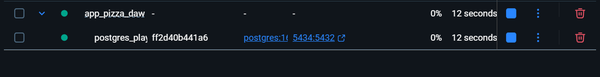
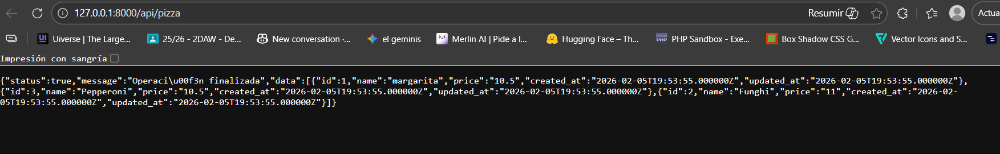
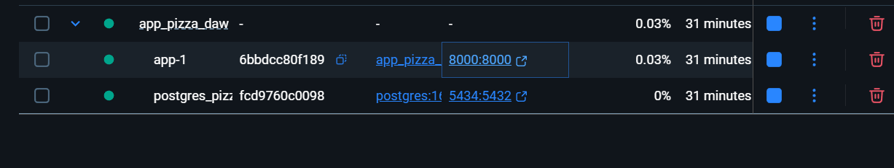
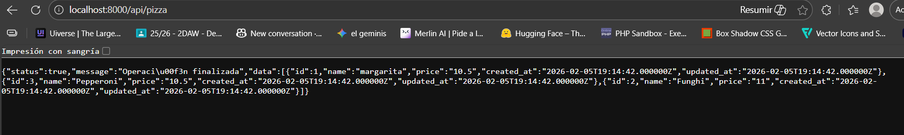
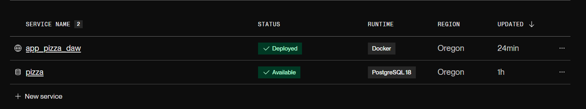
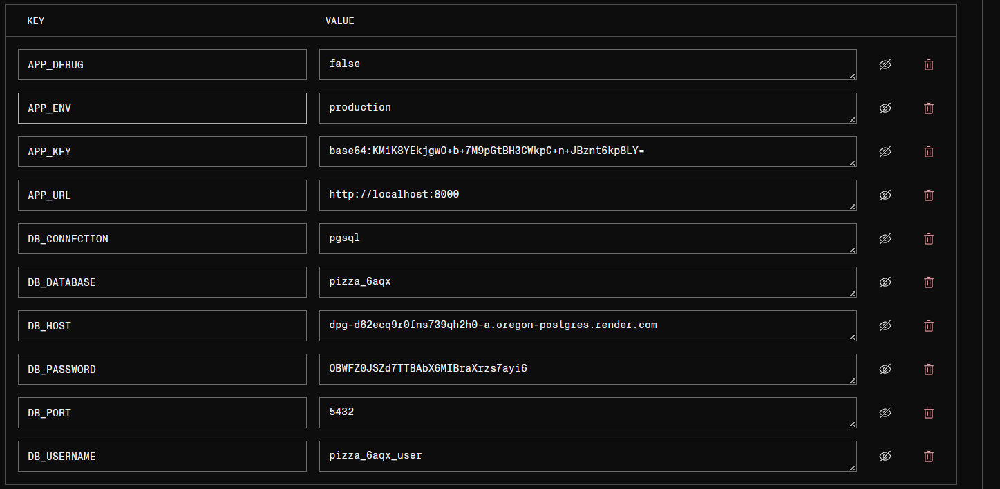
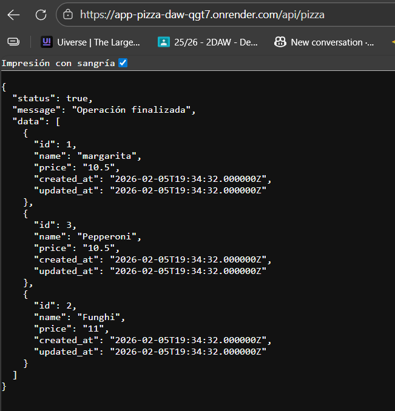

# IMPLEMENTATION.md

## 1. Datos del Alumno

**Nombre completo:** José García Martínez-Abarca

**Fecha:** 05/02/2026

**Repositorio GitHub:** https://github.com/Josegrcia02/app_pizza_daw

---

## 2. Entorno LOCAL

### Descripción

Conexión completa desde local con base de datos dockerizada

### Capturas de Ejecución

**Docker containers corriendo:**

**Backend API funcionando:**

### URLs de Acceso
- Backend: `http://127.0.0.1:8000/api/pizza`
- PostgreSQL: `localhost:5434`

---

## 3. Entorno DEV

### Descripción

Entorno dev, conexión de base datos y backend dockerizado correctamente.

### Capturas de Ejecución

**Docker containers corriendo:**

**Backend API funcionando:**

### URLs de Acceso
- Backend directo: `http://localhost:8000/api/pizza`
- PostgreSQL: `localhost:5432`

---

## 4. Despliegue en Render

### URLs Públicas de los Servicios

**Backend API:**
- URL: `https://app-pizza-daw-qgt7.onrender.com/api/pizza`

### Capturas de Render

**Dashboard con listado de servicios:**

**Variables de entorno - Backend:**

**API funcionando (URL pública):**

---

## 5. Notas Adicionales

**Aquí puedes detallar errores encontrados, decisiones técnicas importantes, o cualquier aspecto relevante de tu implementación.**
yo solo se que no se nada
### Ejemplo 1

**Descripción:**

**Captura (opcional):**

---

### Ejemplo 2

**Descripción:**
[Describe algún error, problema o decisión técnica importante]

**Captura (opcional):**

---

## 6. Reflexión Personal

**¿Qué te ha parecido el examen? ¿Qué has aprendido? ¿Qué ha sido lo más difícil?**

Maria db ni idea pero me ha gustado

---
